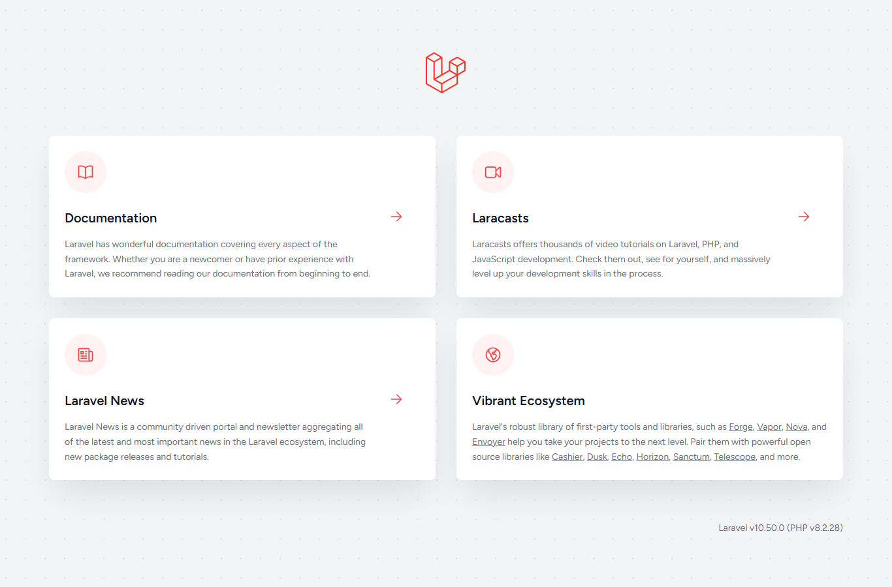
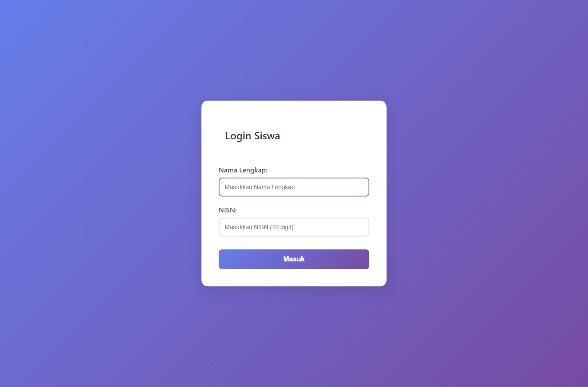
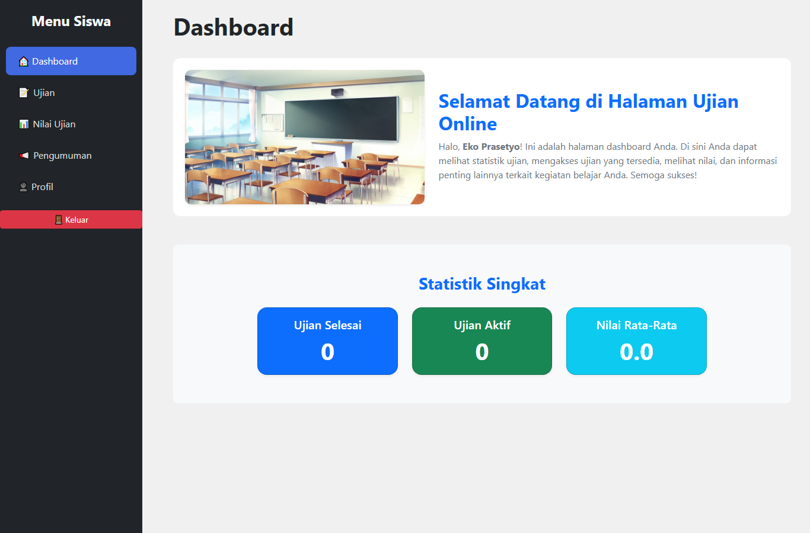
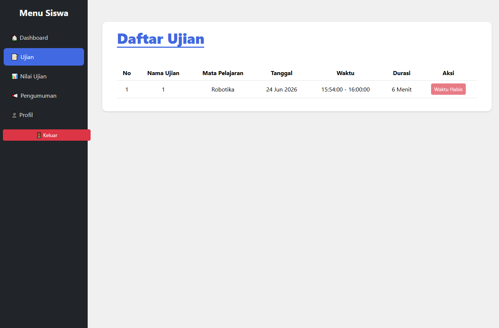
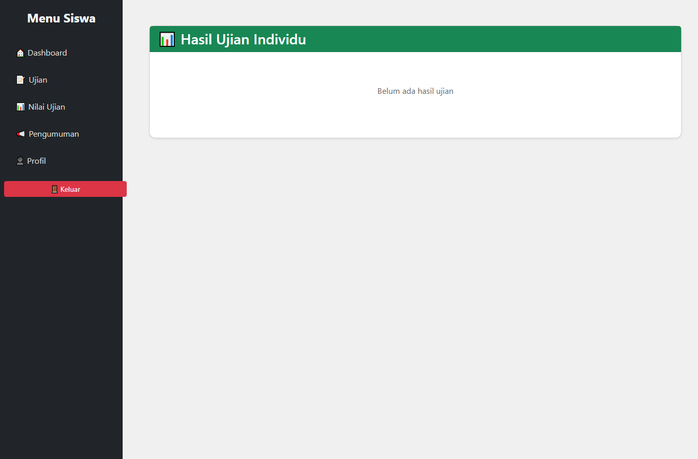
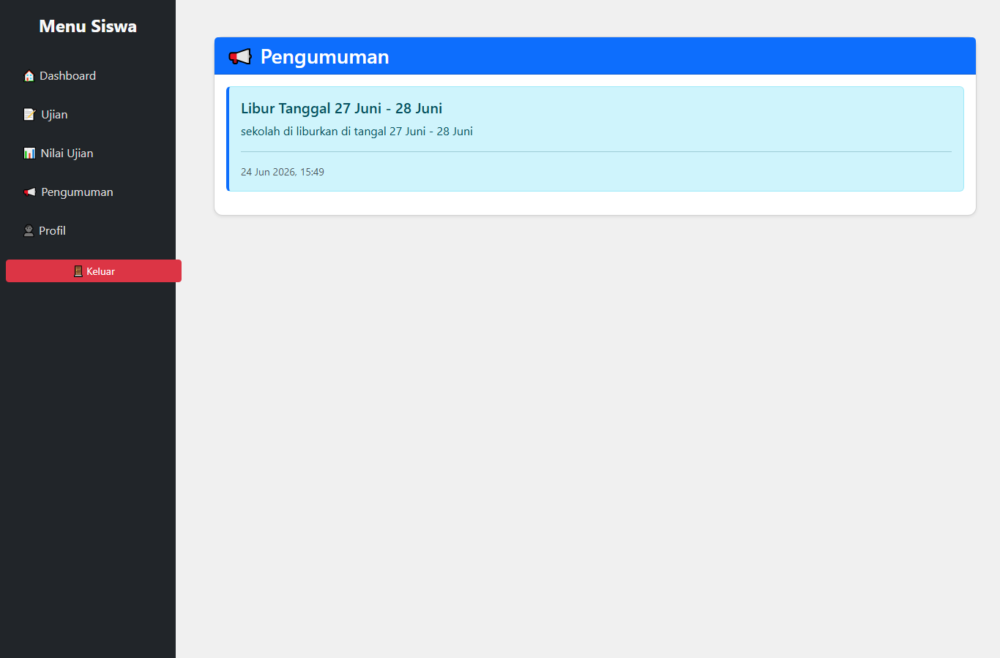
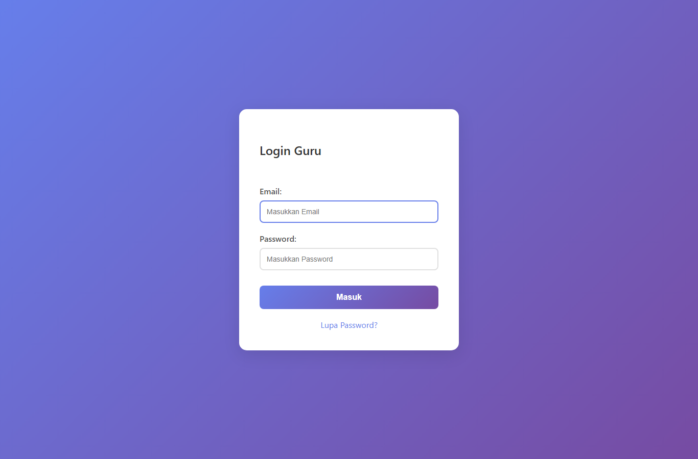
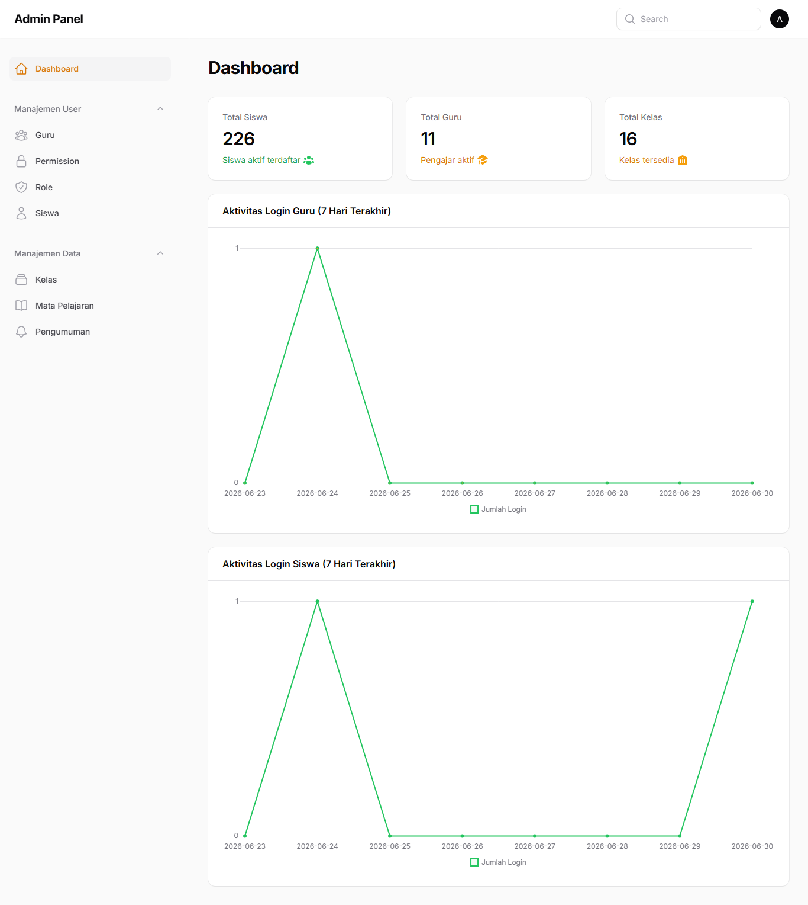

# Sistem Ujian Online Berbasis Web

Aplikasi web untuk pelaksanaan ujian online tingkat SMP dengan tiga peran pengguna (Admin, Guru, Siswa). Dibangun menggunakan Laravel 10 dan panel admin Filament 3. Proyek mata kuliah Pemrograman Web.

## 📸 Tampilan Aplikasi

### Halaman Siswa

| Beranda | Login Siswa | Dashboard |
|:---:|:---:|:---:|
|  |  |  |

| Daftar Ujian | Hasil Ujian | Pengumuman |
|:---:|:---:|:---:|
|  |  |  |

### Login Guru & Panel Admin

| Login Guru | Panel Admin (Filament) |
|:---:|:---:|
|  |  |

## Fitur Utama

**Siswa**
- Login menggunakan Nama + NISN
- Melihat daftar ujian sesuai kelas
- Mengerjakan ujian online dengan timer hitung mundur (auto-submit saat waktu habis)
- Auto-save jawaban per soal via AJAX (tahan terhadap koneksi terputus)
- Validasi waktu ketat (ujian hanya bisa dikerjakan dalam rentang jadwal)
- Pencegahan pengerjaan ulang (retake)
- Mode anti-cheat: blokir copy/paste, klik kanan, dan deteksi perpindahan tab
- Melihat hasil & nilai, serta unduh hasil dalam format PDF
- Halaman pengumuman dan profil

**Guru**
- Login dengan email + password (termasuk reset password via email)
- Manajemen soal, ujian, dan kelas melalui panel Filament
- Laporan nilai siswa (export PDF)

**Admin**
- Dashboard statistik
- Manajemen pengguna, role, mata pelajaran, dan pengumuman

## Teknologi

| Layer | Teknologi |
|---|---|
| Backend Framework | Laravel 10 |
| Admin Panel | Filament 3 |
| Bahasa | PHP 8.1+ |
| Database | MySQL / MariaDB |
| Frontend Build | Vite 5 |
| PDF | barryvdh/laravel-dompdf |
| Auth | Laravel Sanctum (multi-guard) |

## Arsitektur

- **Multi-guard authentication**: tiga alur login terpisah (Siswa, Guru, Admin) dengan controller masing-masing di `app/Http/Controllers/Auth/`.
- **Role-based access control**: middleware `EnsureUserHasRole`, `FilamentAdminAuthenticate`, `FilamentGuruAuthenticate`.
- **Penilaian otomatis**: jawaban siswa dikoreksi terhadap kunci jawaban saat submit, nilai dihitung skala 0–100.
- **Keamanan akses data**: setiap query hasil/jawaban difilter berdasarkan `id_siswa` pengguna yang login (mencegah akses data siswa lain).

## Instalasi

```bash
# 1. Install dependency
composer install
npm install

# 2. Siapkan environment
cp .env.example .env
php artisan key:generate

# 3. Konfigurasi database di .env (DB_DATABASE=ujian_online), lalu:
php artisan migrate --seed

# 4. Build asset & jalankan
npm run build
php artisan serve
```

Akses panel admin/guru (Filament) di `/admin`. Halaman siswa di `/siswa/login`.

## Konfigurasi Penting

- `SESSION_LIFETIME=480` — diset panjang (8 jam) agar sesi tidak habis di tengah ujian.
- Kredensial email (`MAIL_*`) digunakan untuk fitur reset password guru. **Gunakan App Password yang khusus** dan jangan commit `.env` (sudah masuk `.gitignore`).

## Struktur Data Utama

`User`, `Role`, `Siswa`, `Guru`, `Kelas`, `MataPelajaran`, `Ujian`, `Soal`, `JawabanSiswa`, `HasilUjian`, `Pengumuman`.

## Catatan Pengembangan

Proyek ini dibuat untuk tujuan pembelajaran. Untuk deployment produksi disarankan: `APP_DEBUG=false`, rate limiting pada endpoint login, serta backup database berkala.
